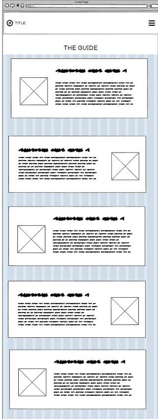

# WORLD EMOJI DAY

## Table Of Contents

* [Introduction](#Introduction)
* [UX](#UX)
    * [User Goals](#User-Goals)
    * [User Expectations](#User-Expectations)
    * [Wireframes](#Wireframes)
* [Features](#Features)
    * [Navigation Bar](#Navigation-Bar)
    * [Website Theme Logo](#Website-Theme-Logo)
    * [Guide](#Guide)
    * [Team](#Team)
* [Technologies Used](#Technologies-Used)
    * [Languages Used](#Languages-Used)
    * [Frameworks, Libraries & Programs Used](#Frameworks)
* [Testing](#Testing)
    * [Validator Testing](#Validator)
    * [Manual Testing](#Manual-Testing)
* [Deployment](#Deployment)
    * [GitHub Pages](#Github)
    * [Forking the GitHub Repository](#Forking)
    * [Cloning the GitHub Repository](#Cloning)
* [Credits](#Credits)
    * [Code](#Code)
    * [Content](#Content)
    * [Media](#Media)
    * [Other](#Other)

## Introduction

## User Goals
1. I communicate with many people online, and want to make sure that my messages aren't being misunderstood
2. I want to learn some fun facts about emojis for world emoji day 
3.s I'm a traveller who wants to know facts about other countries before I go

## User-Expectations
1. I expect to find content easily
2.  I expect content to be laid out in an easy to access way
3. I expect to be able to find out new information in an interesting way 
4. I expect the website to respond to changes in screen size. 

## Wireframes

## Features

## Navigaton bar 
-The navigation bar contains links to all the other pages within the project, it is reposnsive to sizing and resizing for different screen sizes and resolutions.
-The Nav bar is also responsive in sjowing which page the user is currently on
-The nav bar links have aria labels for acessibility

## Guide
-The guide utilizes java script functionality to allow the cards to flip and reveal more information 
-The cards show the images of the emoji on the side 

## Team

The Team page consists of four cards, each one holds a profile image and details of the team member, including their git hub links 

## CREDITS

### Research
- [Rest of World](https://restofworld.org/2021/list-emoji-different-meanings/)
- [Mashable](https://mashable.com/article/emoji-culture-world)
- [Preply](https://preply.com/en/d/emojis-around-the-world--lp)
- [Local Concept](https://en.localconcept.com/blog/2019/07/17/emojis/)

### Code
- [Codepen](https://codepen.io/desandro/pen/LmWoWe)
- [Design Shack](https://designshack.net/articles/trends/best-website-color-schemes/)
