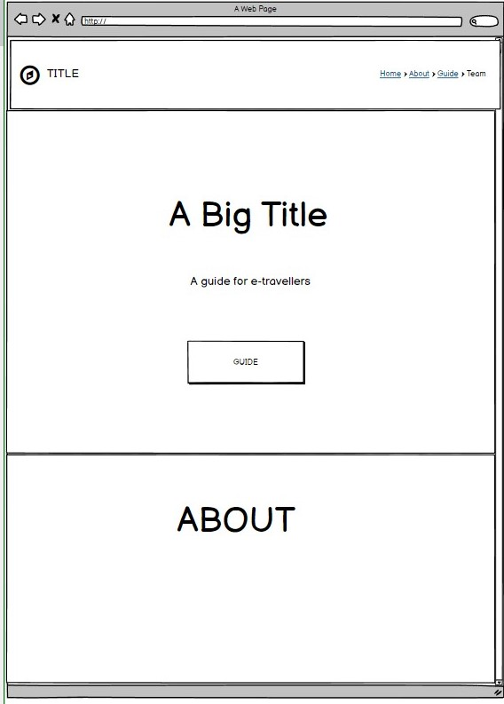
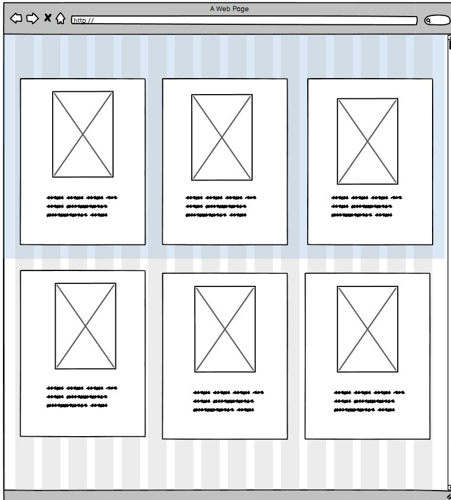
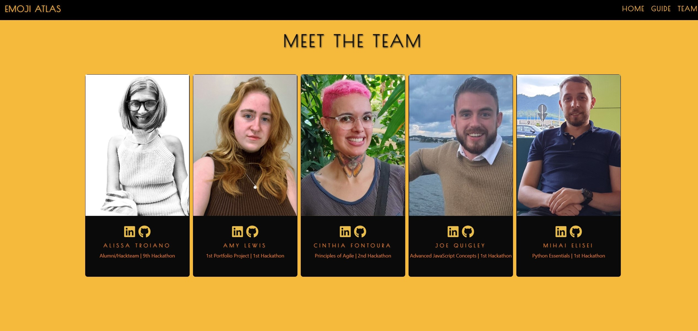
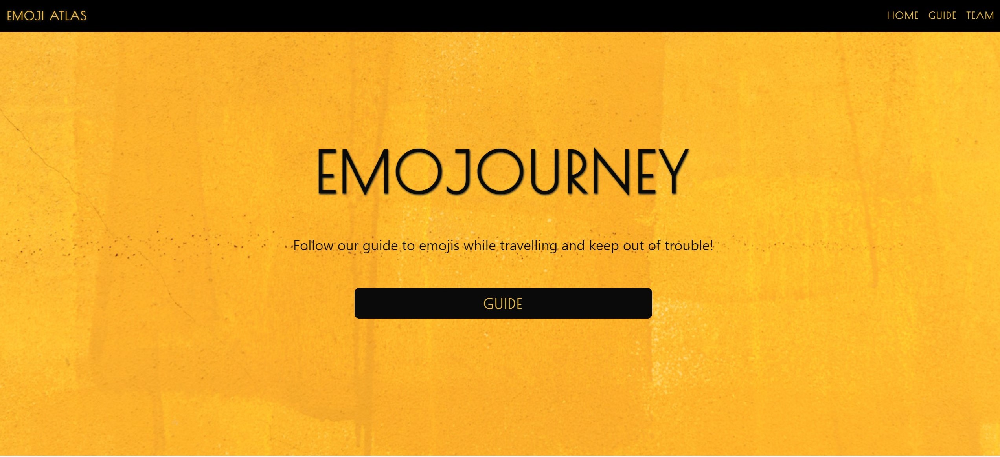
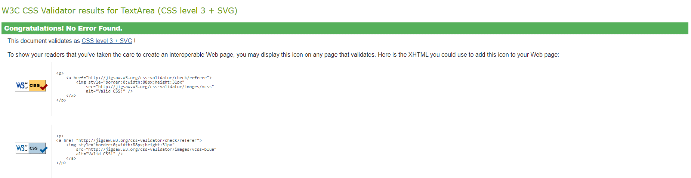
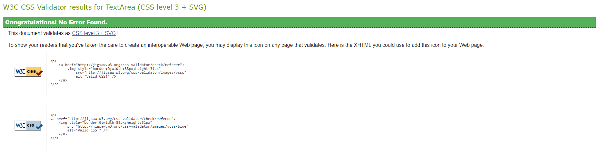

# WORLD EMOJI DAY

## Table Of Contents

* [Introduction](#Introduction)
* [UX](#UX)
    * [User Goals](#User-Goals)
    * [User Expectations](#User-Expectations)
    * [Wireframes](#Wireframes)
* [Features](#Features)
    * [Navigation Bar](#Navigation-Bar)
    * [Website Theme Logo](#Website-Theme-Logo)
    * [Guide](#Guide)
    * [Team](#Team)
* [Technologies Used](#Technologies-Used)
    * [Languages Used](#Languages-Used)
    * [Frameworks, Libraries & Programs Used](#Frameworks)
* [Testing](#Testing)
    * [Validator Testing](#Validator)
    * [Manual Testing](#Manual-Testing)
* [Deployment](#Deployment)
    * [GitHub Pages](#Github)
    * [Forking the GitHub Repository](#Forking)
    * [Cloning the GitHub Repository](#Cloning)
* [Credits](#Credits)
    * [Code](#Code)
    * [Content](#Content)
    * [Media](#Media)
    * [Other](#Other)

## Introduction

### User Goals
1. I communicate with many people online, and want to make sure that my messages aren't being misunderstood
2. I want to learn some fun facts about emojis for world emoji day 
3. I'm a traveller who wants to know facts about other countries before I go

### User-Expectations
1. I expect to find content easily
2. I expect content to be laid out in an easy to access way
3. I expect to be able to find out new information in an interesting way 
4. I expect the website to respond to changes in screen size. 

## Wireframes

## Features

### Navigaton bar 
- The navigation bar contains links to all the other pages within the project, it is reposnsive to sizing and resizing for different screen sizes and resolutions.
- The Nav bar is also responsive in sjowing which page the user is currently on, this solves user expectation 1
- The nav bar links has aria labels for acessibility

### Guide
- The guide utilizes java script functionality to allow the cards to flip and reveal more information, this solves user expectation 3
- The cards show the images of the emoji on the side, with alt tags allowing users to access the images even if they can't see them due to internet or disability issues, this solves expectation 2

### Team
- The team page allows users to see the people behind the project, also providing links to our linkedin pages and github pages

## Landing page
- The landing page provides an explaination into the project, as well as a button taking users to the guide

## Features left to implement

## Technologies used 

### Languages Used 
- [HTML](https://en.wikipedia.org/wiki/HTML)
- [CSS](https://en.wikipedia.org/wiki/CSS)
- [JavaScript](https://en.wikipedia.org/wiki/JavaScript)

### Frameworks
- [Bootstrap5](https://getbootstrap.com/docs/5.2/getting-started/introduction/)
- [Google Fonts](https://fonts.google.com/)
- [Font Awesome](https://fontawesome.com/)

## Testing

## Validator Testing

### HTML

### CSS
- The guide.css file passed W3C CSS validator without any issues. 

- The guide.css file passed W3C CSS validator without any issues. 

### Accessibility 

## Manual Testing

## Deployment

Webapp deployed to GitHub Pages. The steps to deploy are as follows:

- On the project page, click on **Settings**
- Choose **Pages** on left menu
- In the **source section**, choose the branch that you would like to deploy (e.g. main)
- Click on the **save** button, and after a few seconds, you will have access to the URL of the deployed site.
- The live website can be found here &#128073; [Emojourney](https://alissatroiano.github.io/team-8/).

### Forking

To be able to access all the files in their on repositoris the team participants forked [Alissa's](https://github.com/alissatroiano/team-8) repositorie from GitHub by clicking on the **Fork** button on the top right of the page and them on **Create fork** after the page refreshes.

### Cloning

For those teammembers that choose code using a code editor the cloning proccess was as a follow:
- On the repository forked click on **Code** and copy the url.
- Open the terminal on the working folder and type the command <code>git code https://github.com/username/team-8</code> and hit the key "Enter".

## Credits

### Research
- [Rest of World](https://restofworld.org/2021/list-emoji-different-meanings/)
- [Mashable](https://mashable.com/article/emoji-culture-world)
- [Preply](https://preply.com/en/d/emojis-around-the-world--lp)
- [Local Concept](https://en.localconcept.com/blog/2019/07/17/emojis/)

### Code
- [Codepen](https://codepen.io/desandro/pen/LmWoWe)
- [Design Shack](https://designshack.net/articles/trends/best-website-color-schemes/)

### Media

- [Emojis]()
- [Landing Page image]()

## Other

- The code was initialized using the 
- The Wireframes used in this project were created using 
- The website mockup used in the README and testing phases was done using 